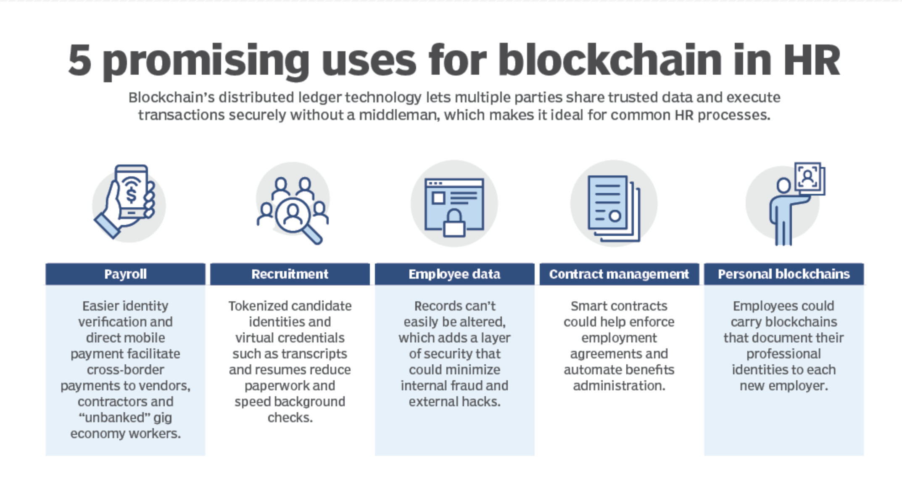

# Human Resources Management System (HRMS) Blockchain Application
A HRMS managed via Ethereum Block chain

# Why?
Blockchain's distributed ledger technology lets multiple parties share trusted data and execute transactions securely without a middleman, which makes it ideal for common HR processes

# What?

TBD

# How?

TBD

# Use-cases
Blow are potential use-cases, which will be architected, designed, develop & deployed to Blockchain Technology

# References

